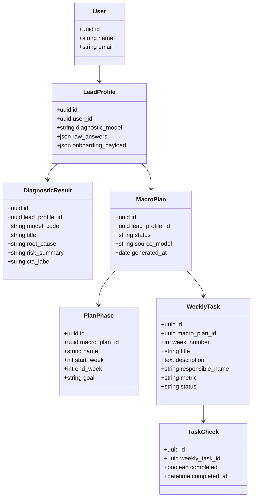
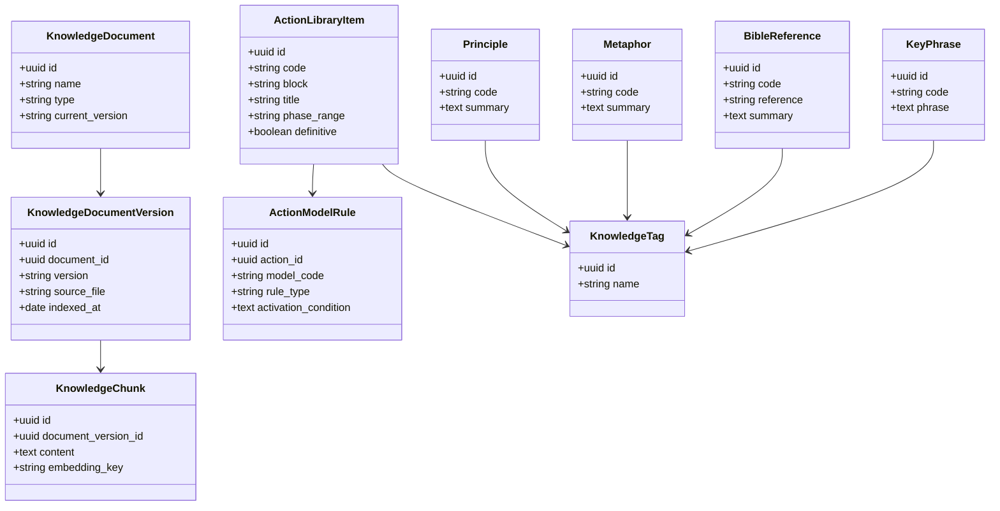

# Sprint Refinement - Jethro

## T10 - Tela de diagnostico

**Description**

Eu como usuario quero visualizar meu diagnostico em uma tela objetiva para entender minha situacao atual e decidir meu proximo passo.

**Entregáveis:**

- Tela de diagnostico com titulo, causa raiz, risco principal e CTA.
- Mapeamento de exibicao por modelo (`A-I`), incluindo o Modelo `I`.
- Estados principais da tela: loading, erro, sucesso e fallback seguro para payload legado.

**Hints:**

- Usar como fonte oficial o motor v2.4 e as mensagens de diagnostico v1.1.
- Exibir apenas a mensagem principal do modelo no MVP, sem depender de randomizacao V1/V2/V3 no frontend.
- Garantir CTA principal para seguir ao plano.
- Considerar compatibilidade com payload antigo sem `q18`.

**Critérios de aceitação:**

- A tela exibe corretamente o modelo retornado pelo motor.
- O conteudo mostrado corresponde ao modelo identificado, inclusive para o Modelo `I`.
- A tela apresenta ao menos nome do diagnostico, causa raiz, risco/precipicio e CTA primario.
- O fluxo continua funcional mesmo quando o payload vier sem `q18`.
- Produto e dev validam que a tela cobre o MVP sem lacunas de conteudo.

**MUST HAVE:**

- Exibir diagnostico para todos os modelos `A-I`.
- Incluir estados loading, erro e sucesso.
- CTA para seguir ao plano.
- Validar com PO e dev antes de `done`.

**SHOULD:**

- Mapear microcopy principal por modelo.
- Preparar estrutura para suportar V1/V2/V3 no futuro.
- Definir empty state/fallback para diagnostico incompleto.

**Arquivos para anexar:**

- `/Users/daniellopes/Downloads/OneDrive_1_23-03-2026/01-Jethro_Motor_v2_4_Daniel.docx`
- `/Users/daniellopes/Downloads/OneDrive_1_23-03-2026/02-Jethro_Mensagens_Diagnostico_v1_1.docx`
- `/Users/daniellopes/Downloads/OneDrive_1_23-03-2026/Jethro_Logica_98pct.docx`

**Sprint**

- Refinement / MVP Plano

---

## T11 - Plano macro 6 meses por perfil

**Description**

Eu como usuario quero visualizar um plano macro de 6 meses por etapa para ter direcao clara de medio prazo.

**Entregáveis:**

- Estrutura do plano de 24 semanas dividida em fases.
- Visualizacao resumida por etapa com foco principal e entregas esperadas.
- Mapeamento de como o perfil/modelo influencia o plano macro.

**Hints:**

- Usar a estrutura oficial: Fundamento (`S1-S4`), Estrutura (`S5-S12`), Escala (`S13-S20`), Legado (`S21-S24`).
- O plano macro deve funcionar mesmo antes do detalhamento das tarefas.
- A exibicao precisa refletir o modelo do usuario.
- Aproveitar o template de 30 dias como ponte entre diagnostico e plano de 24 semanas.

**Critérios de aceitação:**

- O usuario visualiza as 4 etapas do plano com seus periodos.
- Cada etapa apresenta foco principal e entregas esperadas.
- O plano macro muda conforme o perfil/modelo do usuario.
- O plano macro permanece coerente com o diagnostico recebido.
- Produto e dev validam que a representacao cobre o MVP sem lacunas.

**MUST HAVE:**

- Exibir 4 fases do plano com semanas correspondentes.
- Refletir personalizacao por modelo.
- Permitir consumo pela UI mesmo sem tarefas detalhadas.
- Validar com PO e dev antes de `done`.

**SHOULD:**

- Exibir marcos principais por fase.
- Destacar objetivo principal de cada etapa.
- Preparar espaco para evoluir depois para milestones mensais.

**Arquivos para anexar:**

- `/Users/daniellopes/Downloads/OneDrive_3_23-03-2026/4-Jethro_Camada3_v1_10.docx`
- `/Users/daniellopes/Downloads/OneDrive_3_23-03-2026/5-Jethro_Template_30Dias_v2.docx`
- `/Users/daniellopes/Downloads/OneDrive_3_23-03-2026/2-Jethro_Alma_Rogerio_v5_14.docx`

**Sprint**

- Refinement / MVP Plano

---

## T12 - Engine perfil para plano

**Description**

Eu como usuario quero que meu plano seja gerado automaticamente conforme meu perfil para receber um direcionamento personalizado.

**Entregáveis:**

- Regra de geracao que transforma `modelo + JSON do onboarding` em plano macro persistivel.
- Mapeamento de selecao de acoes por modelo com calibracao por variaveis do usuario.
- Payload final pronto para consumo pela UI de plano e tarefas.

**Hints:**

- Seguir como fonte principal a Camada 3 v1.10.
- Considerar as entradas minimas: modelo, meta_6_meses, faturamento, custo fixo, margem, ticket, clientes, canal, objecao e equipa.
- O Modelo `I` precisa de fluxo especifico e nao deve receber regras de faturamento/operacao antes da validacao.
- Persistir o resultado ja estruturado para evitar recalculo na UI.

**Critérios de aceitação:**

- A engine gera estrutura valida para qualquer modelo suportado.
- A selecao e a prioridade das acoes mudam conforme o perfil do usuario.
- O plano respeita pre-requisitos e exclusoes documentadas na Camada 3.
- O Modelo `I` tem tratamento especifico e coerente com o bloco `PRE`.
- Dev e produto validam que o payload final atende o MVP da UI.

**MUST HAVE:**

- Suportar modelos `A-I`.
- Aplicar regras da Camada 3 com calibracao por JSON.
- Gerar payload persistivel para plano macro.
- Validar com PO e dev antes de `done`.

**SHOULD:**

- Deixar rastreavel quais regras/acoes foram aplicadas.
- Preparar a estrutura para regeneracao futura do plano.
- Facilitar extensao para semanas 3-24 detalhadas.

**Arquivos para anexar:**

- `/Users/daniellopes/Downloads/OneDrive_1_23-03-2026/01-Jethro_Motor_v2_4_Daniel.docx`
- `/Users/daniellopes/Downloads/OneDrive_3_23-03-2026/1-Jethro_Onboarding_v1_3.docx`
- `/Users/daniellopes/Downloads/OneDrive_3_23-03-2026/4-Jethro_Camada3_v1_10.docx`
- `/Users/daniellopes/Downloads/OneDrive_1_23-03-2026/Jethro_Logica_98pct.docx`

**Sprint**

- Refinement / MVP Plano

---

## T13 - Tarefas semana 1-2 por perfil

**Description**

Eu como usuario quero receber tarefas praticas e mensuraveis para as semanas 1 e 2 para iniciar a execucao sem travar.

**Entregáveis:**

- Geracao das tarefas das semanas 1 e 2 com titulo, descricao, responsavel e metrica.
- Estrutura de tarefa com criterio claro de conclusao.
- Regras para manter coerencia entre modelo, plano e tarefas.

**Hints:**

- Usar o Template de 30 Dias como referencia principal das semanas 1 e 2.
- Toda tarefa precisa ser acionavel e mensuravel.
- Incluir responsavel real sempre que o onboarding trouxer nomes de equipa.
- Para o Modelo `I`, seguir o bloco `PRE` e nao antecipar FIN/OPE/LID antes da validacao.

**Critérios de aceitação:**

- Cada usuario recebe tarefas coerentes com seu modelo e plano.
- As tarefas das semanas 1 e 2 sao praticas e mensuraveis.
- As dependencias entre tarefas sao respeitadas.
- O sistema consegue rastrear a origem das tarefas a partir do plano gerado.
- Produto e dev validam que o detalhamento cobre o MVP inicial de execucao.

**MUST HAVE:**

- Gerar tarefas para semanas 1 e 2.
- Incluir responsavel, metrica e criterio de conclusao.
- Respeitar regras especificas do Modelo `I`.
- Validar com PO e dev antes de `done`.

**SHOULD:**

- Incluir armadilha/risco da semana quando aplicavel.
- Preparar a estrutura para evoluir depois para semanas 3 e 4.
- Permitir reprocessamento das tarefas sem perder rastreabilidade.

**Arquivos para anexar:**

- `/Users/daniellopes/Downloads/OneDrive_3_23-03-2026/5-Jethro_Template_30Dias_v2.docx`
- `/Users/daniellopes/Downloads/OneDrive_3_23-03-2026/4-Jethro_Camada3_v1_10.docx`
- `/Users/daniellopes/Downloads/OneDrive_3_23-03-2026/2-Jethro_Alma_Rogerio_v5_14.docx`
- `/Users/daniellopes/Downloads/OneDrive_3_23-03-2026/1-Jethro_Onboarding_v1_3.docx`

**Sprint**

- Refinement / MVP Plano

---

## T14 - UI plano + tarefas

**Description**

Eu como usuario quero visualizar meu plano e marcar minhas tarefas semanais para acompanhar meu progresso.

**Entregáveis:**

- Fluxo navegavel da experiencia de plano e tarefas.
- Tela de plano macro com acesso ao detalhe das semanas.
- Checklist de tarefas com status e indicador de progresso.

**Hints:**

- Comecar pelo fluxo critico: Diagnostico > Plano macro > Tarefas semanais.
- Prever estados loading, erro, sucesso e lista vazia.
- Priorizar CTA principal em zona facil de alcance.
- O estado concluido precisa persistir.

**Critérios de aceitação:**

- O usuario visualiza o plano macro e acessa o detalhe das tarefas.
- O usuario consegue marcar tarefas como concluidas.
- A UI reflete progresso por semana e progresso geral.
- O estado das tarefas persiste ao recarregar.
- Produto e dev validam que o fluxo cobre o MVP sem lacunas.

**MUST HAVE:**

- Visualizacao do plano macro.
- Checklist de tarefas com status.
- Estados loading, erro, sucesso e empty state.
- Validar com PO e dev antes de `done`.

**SHOULD:**

- Mapear componentes reutilizaveis da experiencia.
- Definir microcopy principal de CTA/erro.
- Preparar a estrutura visual para futuras semanas.

**Arquivos para anexar:**

- `/Users/daniellopes/Downloads/OneDrive_3_23-03-2026/5-Jethro_Template_30Dias_v2.docx`
- `/Users/daniellopes/Downloads/OneDrive_3_23-03-2026/4-Jethro_Camada3_v1_10.docx`
- `/Users/daniellopes/Downloads/OneDrive_1_23-03-2026/02-Jethro_Mensagens_Diagnostico_v1_1.docx`

**Sprint**

- Refinement / MVP Plano

---

## T15 - Tabelas necessarias para a Alma do Rogerio

**Description**

Eu como sistema quero persistir a base da Alma do Rogerio em tabelas estruturadas para suportar RAG, regras de selecao e geracao de plano com rastreabilidade.

**Entregáveis:**

- Modelagem inicial das tabelas da base de conhecimento.
- Estrutura com versionamento por documento e origem.
- Relacoes para acoes, principios, metaforas, versiculos, frases-chave, regras e chunks.

**Hints:**

- Pensar nas necessidades de 3 consumidores: importacao, engine de plano e RAG.
- Prever associacao por modelo, tags e versao.
- Separar documento original, versao indexada e chunk recuperavel.
- Garantir rastreabilidade do item ate o arquivo de origem.

**Critérios de aceitação:**

- A modelagem suporta versionamento da Alma do Rogerio.
- Uma acao pode ser ligada a multiplos modelos e gatilhos.
- Principios, metaforas, versiculos e frases-chave podem ser recuperados por tag/modelo.
- A estrutura suporta chunking/indexacao para RAG.
- Dev valida que o schema atende engine e base de conhecimento sem lacunas.

**MUST HAVE:**

- Tabelas para documentos, versoes, chunks e biblioteca de acoes.
- Associacoes por modelo/tag.
- Rastreabilidade de origem por arquivo/versao.
- Validar com PO e dev antes de `done`.

**SHOULD:**

- Preparar campos para embeddings/indexacao.
- Facilitar importacao incremental de novas versoes.
- Deixar caminho pronto para backoffice de manutencao futura.

**Arquivos para anexar:**

- `/Users/daniellopes/Downloads/OneDrive_3_23-03-2026/2-Jethro_Alma_Rogerio_v5_14.docx`
- `/Users/daniellopes/Downloads/OneDrive_3_23-03-2026/3-Jethro_RAG_Spec_v1_9.docx`
- `/Users/daniellopes/Downloads/OneDrive_3_23-03-2026/4-Jethro_Camada3_v1_10.docx`
- `/Users/daniellopes/Downloads/OneDrive_3_23-03-2026/1-Jethro_Onboarding_v1_3.docx`

**Sprint**

- Refinement / Base de Conhecimento

---

## Diagrama de Classes - Dominio do App

## Diagrama de Classes - Base Alma do Rogerio

